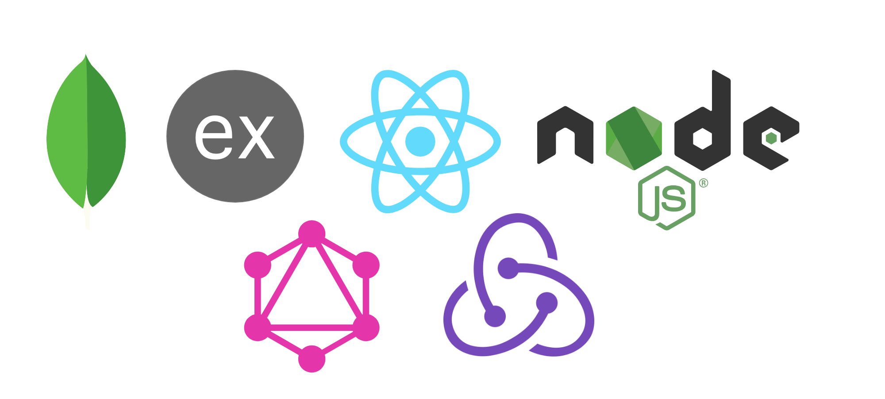

 # The Site --> [TaskTrader](https://task-trader.herokuapp.com/)

# MERN +GRaphQL+Redux


- [mongoDB](https://docs.mongodb.com/manual/core/schema-validation/)
  - [mongoose.js](https://mongoosejs.com/)
- [express](https://expressjs.com/en/guide/routing.html)
- [React](https://reactjs.org/docs/components-and-props.html)
  - [React Router](https://reacttraining.com/react-router/web/guides/quick-start)
- [Node.js](https://nodejs.org/en/about/)
- [GraphQL](https://graphql.org/learn/queries/)
- [Redux](https://redux.js.org)

## testing
```npm run dev```

## Develoment Purposes Only! - Delete before final application production

```npm init```

I have not deleted the config folder with the keys. But you can use my key if you want for development or I can add you to the cluster. 

We just need to make sure that we change it when we are deploying it so that it will run on heroku.

Everything should run once you have done the init. 

There is still a problem with the navbar showing up on the login page but I am going to try a couple of solutions. I think the biggest one is just organzing the way the front is layered a little more. 

Anyways the routing should still work so for development purposes we should be okay. 
